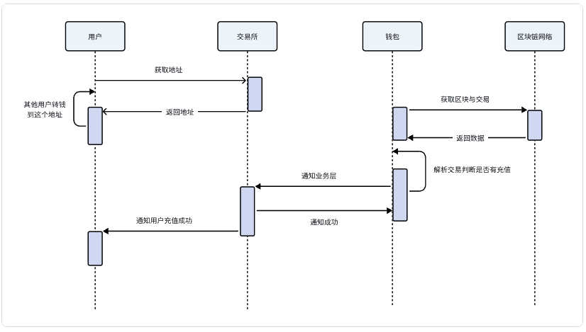
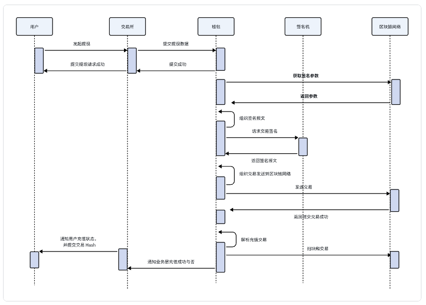
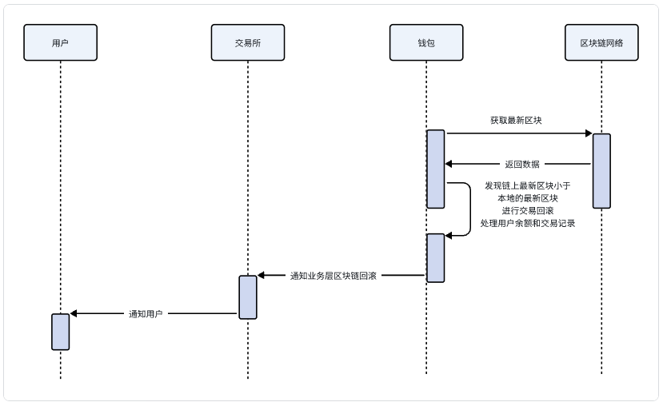
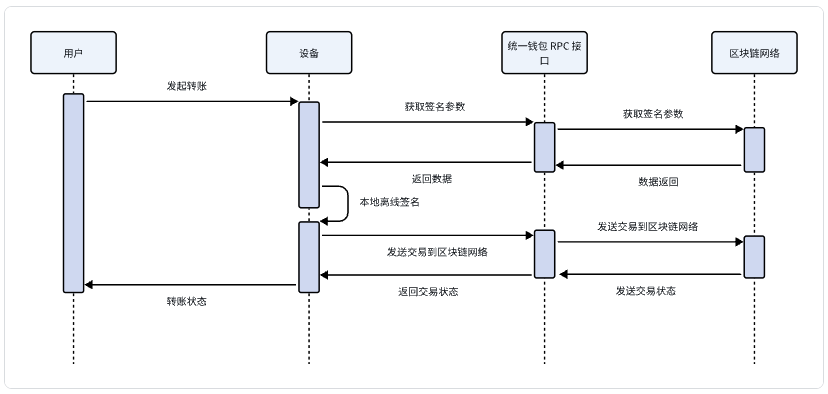
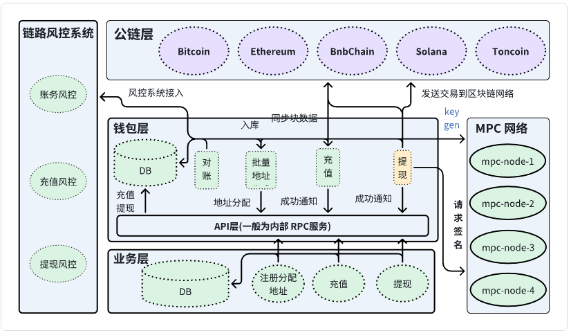
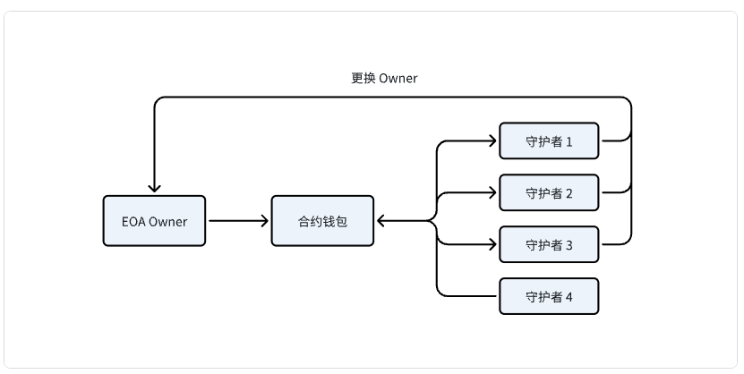

# 钱包教程 1--探索不同类别的 Web3 钱包底层奥秘

# **1.概述**

熟悉区块链的人都知道，区块链的钱包之所以被分成不同的类别，起本质其实就是私钥的管理方式不同。

# **2. 钱包类别**

- 中心化钱包：钱包私钥一般管理在中心化服务器上，代表项目为交易所钱包；例如 Binance 交易所钱包，okx 交易所钱包和 bybit 交易所钱包等。
- 去中心化钱包(确定性分层钱包)：钱包私钥一般管理在用户的设备上，代表项目为 TP, ImToken, MetaMask 等；
- 硬件钱包：钱包私钥管理在离线的硬件设备上，代表项目 ledger, onekey 等。
- 交易所 Web3 钱包：一般的交易所 Web3 钱包集成了，中心化钱包，去中心化钱包(确定性分层钱包)和硬件钱包的功能。
- 托管钱包：一般为 MPC 算法，每个节点有一个密钥片，网络中没有完整的私钥出现过, N-M 的签名方式，总节点为 N 个，M 个节点签名交易即有效。
- 多签钱包：EVM 链一般使用 gnosis safe 多签，其他使用传统密码学方式多签
- 社交恢复钱包: 密钥分片备份和守护者恢复
- EVM 链 AA 钱包：ERC4337 协议独有特性

# 3. 中心化钱包

## 3.1. 中心化钱包架构图

交易所使用的钱包一般都称为中心化钱包，原因是交易所钱包私钥一般管理在中心化服务器上，不同的交易所的私钥管理方式也不一样

最简单的方式莫过去将私钥做一层 DES 加密之后存储在数据库或者 waller.data数据文件中，其次是使用 KMS 环境保存加密的私钥，不管是使用数据文件或者 KMS 保存私钥，交易签名的时候都需要解密私钥之后就行签名，私钥暴露的风险最大，团队成员作恶也非常容易。

其次是 Tee 环境，Tee 环境虽然是一个安全的执行环境，但是私钥也是加密之后存储在这个环境的数据库或者文件里面，每次签名也要在这个环境中解密私钥进行签名，私钥暴露的风险也很大，团队成员想拿到私钥也很容易，只需要签名前传人私钥是打一个日志就行。

最安全和最专业的做法是使用 cloadHSM 或者多节点备份的小型签名机，私钥不会离开设备，需要签名的时候，传入待签名的报文，cloadHSM 或者小型签名机签名结束之后返回签名报文，然后整理签名交易报文发送到区块链网络。

不管是使用数据库、数据文件、 KMS、TEE，还是 CloadHSM，安全级别也是相对的，有一句话说得好: "**外贼易挡，家贼难防**"，这句话用在钱包管理上真的是太正确了。不管用什么方案，即使是 CloadHSM 或者小型机方案，"家贼也是很难防"，家贼完全可以模拟一笔合法的交易让 CloadHSM 或小型机方案签名，然后把钱盗走。为了防止家贼，正常的交易所钱包都要做链路风控体系。

从上面的架构图中，我们可以看到，对于交易所钱包来说，通常有这些业务流程

- 批量地址生成
- 充值
- 提现
- 归集
- 热转冷
- 冷转热
- 链路风控

很多公司钱包开发，一般就是一个人负责整条链钱包的调研(离线地址生成，离线交易签名和扫块出入金)，开发（含充值，提现，归集，热转冷等功能开发，甚至含链路风控的一部分代码）和测试。当然，也有的公司分为三到四团队，调研和离线签是一个团队，扫链出入金，归集和转冷等功能是一个团队，链路风控是一个团队，测试是一个团队。不管怎么分，运维和开发是隔离的，这样做才能做大限度做到人为风控。

## 3.2. 中心化钱包业务细节流程

- 批量地址生成：交易所钱包为了性能和快速响应用户，所有交易所钱包都会有一个地址池，地址池里面每次生成成千上万的地址，当用户注册到交易所的时直接给用户分配地址，而不是去生成；当地址池里面的地址少于一定数量时就会去新生成一批。

- 充值：扫链服务扫区块链，解析区块里面的交易数据，当交易数据里面的 to 地址是系统里的用户地址时，就说明有用户充值；充值这个过程除了钱包充值扫块之外，还会和风控一起联合，只有风控系统和钱包都认可这笔交易，才会通知业务层；解析的时候需要注意有人构造恶意交易，有的链是可以构造交易攻击的。

- 提现:  客户端用户输入要提现的地址，金额，链；这些数据将进入交易所业务层，业务层提交数据给钱包，并建立签名参数风控；钱包拿到交易数据之后先验证是否能过风控，没有问题的去链上获取签名参数，组织交易之后生成待签名的交易报文，将交易报文递给签名机，签名机签名之后返回签名的交易报文，钱包服务组织交易之后发送到区块链网络。交易发送完成之后，扫链服务扫到这笔交易之后，验证风控，通过之后通知业务层提现成功，上报交易 Hash 等信息。

- 归集：归集功能是把用户地址里面的资金全部归集到一个规整地址里面去，归集是一个批量转账的过程，和提现的逻辑比较类似，就是业务类别不一样，这里就不再画流程图了。
- 转冷：将归集地址里面的资金转到一个冷钱包，归集是一个单笔转账的过程，和提现的逻辑比较类似，就是业务类别不一样，这里就不再画流程图了。
- 冷转热：从冷钱包将资金转到热钱包，手动操作的过程
- 交易回滚：交易回滚是指区块链网络的区块回滚或者重组，需要将钱包系统中的交易处理掉的过程，比方说：现在有一条链区块一下从 1000 个块回滚到 500 个块，那么钱包系统里面存储的 500-1000 个块的交易就是无效交易了，需要处理在这个块范围的所用用户的交易。

- 钱包风控：钱包风控在整个项目中占据重要的角色，不管是充值，提现，归集，转冷，冷转热中的每一笔交易，业务层和钱包底层都应该建立完善的风控体系。
- 对账系统: 钱包系统与业务层对账，钱包系统实时资产负债表等。

# 4. 去中心化钱包(HD 钱包)

## 4.1. 去中心化钱包架构图

去中心化钱包的私钥是管理在用户设备中的，除了用户本人和牛逼的黑客，没有人接触得到。一般的去中心化钱包都是确定性分层钱包；先生成助记词，助记词导出主私钥，主私钥扩展子私钥和公钥匙的方式，公钥再导出地址。

去中心化钱包的私钥一般是加密之后存储在本地设备 sqlite 或者数据文件里面，当要签名交易的时候，需要用户输入密码解密私钥之后再签名。

去中心化钱包一般有以下几个业务流程：

- 收款
- 转账
- 转账记录
- 闪兑
- Dapp 浏览器

去中心化钱包比较出名的有 Tp，ImToken，MetaMask 等，我们项目实战中将会带大家用 RN 开发一款类似 TP 的钱包。

## 4.2.去中心化钱包细节业务流程

- 收款：查询本地设备数据库把地址展示到界面上。
- 转账

- 转账记录：根据地址查询交易记录和根据 Hash 查询交易详情
- 闪兑：钱包里面的闪兑一般对接 1inch 或者其他的 aggrator 实现兑换功能
- Dapp 浏览器：Dapp 浏览器是指 Dapp 可以在里面运行，能够正常的和钱包进行交互，有以下几种主流的实现方式 Web View 中包裹 Dapp, 通过 Js 注入 Windows 对象的方式通信，一般钱包开发直接使用这种方式 Websocket 进行 Dapp 和钱包之间的通信

# 5. 硬件钱包

## 5.1. 硬件钱包架构图

硬件钱包主要是把私钥管理在离线的硬件设备中，在硬件设备中集成钱包签名算法，一般使用蓝牙，NFC 或者串口通信进行通信。

硬件钱包一般有以下几个业务流程：

- 地址生成：硬件中集成 BIP，生成助记词和密钥对，使用公钥导出钱包地址；
- 离线签名：组织交易生成 32 位的 Msg Hash, 将签名消息摘要传给硬件，硬件签名之后返回，组织交易发送到区块链网络。

## 5.2. 硬件钱包细节业务流程

硬件钱包和去中心化钱包相比，最不相同是私有的管理方式，硬件钱包私钥和助记词管理在硬件中，下面一离线地址生成和离线签名为例说明：

- 离线地址生成：发不地址生成的指令给硬件，硬件会生成助记词和私钥等信息，并将私钥和助记词编码加密之后存储在硬件中，吐出公钥匙，钱包界面端用公钥匙生成地址。
- 离线签名：用户端组织编码交易报文，发送给硬件签名，签名回来的交易报文再次组织，然后发送到区块链网络。

# 6. MPC 托管钱包

## 6.1. 托管钱包架构图

## 6.2. 托管钱包业务流程图

托管钱包和其中心化钱包相比，不相同的地方也是密钥的管理方式，在托管系统中，一般使用 MPC 网络，一共有 M 个节点，其中 N 节点签名交易就有效。每个节点掌握一个密钥片，在整个网络中没有出现过完整的密钥；下面也地址生成和交易签名为例说明

- 地址生成：业务端发出 Keygen 指令，MPC 网络经过多轮共识之后各自产生密钥片，并吐出聚合公钥，业务端使用公钥导出地址。
- 离线签名：业务端发出 Sign 指令, 并携带待签名的交易报文到 MPC 网络，MPC 网络经过多轮签名成公共，返回签名串给业务端，业务端将交易发送到区块链网络。

# 7. 多签钱包

多签钱包有点像 MPC 钱包的工作机制，但又完全不一样。 多签钱包的工作机制涉及多个密钥和 M-of-N 签名的概念。在 M-of-N 设置中，只有 N 个密钥中的 M 个对交易进行了签名，才能授权该交易。例如，在 2-of-3 多签钱包中，存在三个私钥，至少需要两个私钥才能授权交易。

关于 gnosis safe 多签钱包，在钱包章节我们不深入讲解，将会在后面的合约课程中深入讲解。

# 8. 社交恢复钱包

社交恢复钱包现在是属于不流行阶段，其使用门槛稍微高了一些，而且现有的社交恢复的技术解决方案不够完美，这也是社交恢复钱包直到今天为止做得不太好的原因。

## 8.1. 守护者恢复

守护者恢复是使用合约的方式来实现的，用户的钱包是一个合约钱包，由一个 EOA 地址控制；用户可以给这个钱包设置 N 个守护者，当用户的私钥丢失时，可以让这些守护者联合签名一个交易替换这个合约钱包的 owner。

## 8.2. 密钥分片回复

密钥分片社交恢复钱包是使用门限秘密共享的密码学技术方案对钱包的助记词或私钥进行切片备份管理，当用户的助记词或私钥丢失，可以发起社交恢复的方式进行助记词和私钥的恢复，在密钥分片社交恢复钱包中，可以将助记词和私钥屏蔽，不在需要用户自己去备份助记词和私钥，而是通过社交的方式进行助记词和私钥的备份。

在密钥分片钱包中，我们整个社交恢复的流程如下：

- 用户的私钥或者助记词和一个大随机数做一次异或算法，得到一个新的秘密值，我们把大随机数叫做 head, 秘密值叫做 body，head 加密之后上传到 savour wallet 云端。
- 将 body 做门限共享秘密算法，拆分成 N 份 shadow, 设置 K 份可以恢复 body
- shadow-1 加密之后存储在本地，使用 AES 加密，密码Hash之后做为加密 Key，
- shadow-2 加密之后存储到savour wallet 云端，使用 AES 加密，密码和设备 ID 做为加密 Key
- shadow-3 ... n 加密之后存储到密钥柜和社交圈的好友
- 助记词或者私钥丢失发起恢复，获取密钥柜里面或者好友处的 k - 2 份私钥，再获取云端的 shadow-2 和 header。
- 逆门限共享秘密算法通过 K 份 shadow 恢复出 body
- body 和 head 做逆异或算法得到助记词和私钥。 关于密钥柜： 密码柜是一个密钥托管服务，用户可以自行运行密钥柜服务存储自己的密钥 shadow，也可以将密钥 shadow 加密之后保存到我们官方密钥柜，密钥柜对接的是各大区块链存储平台，我们将把密钥进行深层次加密之后把密钥上传到各大区块链存储平台，即使有一天密钥柜不运行了，用户也可以从各大区块链存储平台获取到自己加密的密钥分片，根据加密规则进行解密就可以得到明文的密钥 shadow，同时根据上面的设计图用户还可以通过隐私社交的方式备份自己的密钥 shadow

# 9. EVM 链 AA 钱包

EIP4337 账户抽象钱包不仅仅是普通的钱包，它们本身就是智能合约, 主要有安全性高，gas 代付等特点，目前很多公司和项目方都已经或者正在集成账户抽象钱包，但是 AA 钱包目前不是一个很好的赛道，实际应用的公司并不多。

AA 钱包和  gnosis safe 多签钱包一样，很多都是智能合约，故而我也在智能合约章节中仔细讲解它， 这里不在做过多的赘述。

如果有兴趣，更多详情可以参阅：https://eips.ethereum.org/EIPS/eip-4337

# 10. 总结

对于钱包来说，大家需要更好的掌握交易所钱包，去中心化钱包，硬件钱包和 MPC 托管钱包，目前这四种钱包应用最广泛，工作岗位最多。关于 gnosis safe 多签钱包,  AA 钱包等，了解即可以，需要使用的时候再学习就行了。话虽然这样说，但是关于 gnosis safe 多签钱包和 AA 钱包，我们在智能合约阶段的课程中也会给大家详细讲解。

值得一说的是，整个钱包课程使用总-分-总的形势铺开，先整体理解钱包的类别，架构以及各模块的实现逻辑，然后再深入讲解钱包的知识细节，最后通过项目实战的形势收回到这篇文章。当然，整个钱包课程也是根据这篇文章展开的，这篇文章的内容也是我们钱包课程第一节课的内容，希望大家有时间好好阅读，深入体会。